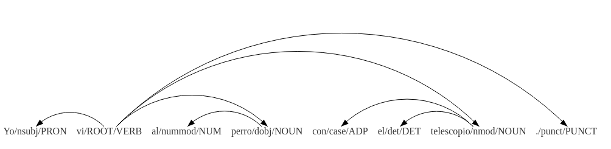

Practico 4
==========

## Entrenamiento y evaluación de Syntaxnet

Para este práctico se propone entrenar y evaluar un modelo basado en redes neuronales descripto en el siguiente [paper](http://arxiv.org/pdf/1603.06042v2.pdf).
Para ello se utiliza el framework SyntaxNet basado en TensorFlow, que es una implementación de este Parser de Dependencias.

Los pasos que se siguieron fueron los siguientes:
+ Se descargo el código fuente desde [github](https://github.com/tensorflow/models/tree/master/syntaxnet).

+ Se instalaron las dependencias necesarias para que SyntaxNet funcione:

  - python 2.7
  - bazel 0.2.2b
  - swig
  - protobuf
  - asciitree
  - numpy

+ Además se instaló Cuda 7.5 para poder utilizar tensorflow con la GPU. Se siguieron los siguientes issues [#173](https://github.com/tensorflow/models/issues/173) y [#248](https://github.com/tensorflow/models/issues/248)

SyntaxNet es un parser de dependencias basado en transiciones, que construye el parseo incrementalmente.
El entrenamiento del modelo consiste en primero entrenar un POS Tagger. Luego se utilizan estos outputs como features para el entrenamiento del parser de dependencias.
Este entrenamiento consiste en dos partes:

1. *Local pre-training* : un pre entrenamiento utilizando decisiones locales.
Una vez que se tiene el corpus taggeado, se entrena un parser de dependencias normalizado localmente, con el siguiente comando:

```shell
bazel-bin/syntaxnet/parser_trainer \
  --arg_prefix=brain_parser \
  --batch_size=32 \
  --projectivize_training_set \
  --decay_steps=4400 \
  --graph_builder=greedy \
  --hidden_layer_sizes=200,200 \
  --learning_rate=0.08 \
  --momentum=0.85 \
  --output_path=models \
  --task_context=models/brain_pos/greedy/$PARAMS/context \
  --seed=4 \
  --training_corpus=tagged-training-corpus \
  --tuning_corpus=tagged-tuning-corpus \
  --params=200x200-0.08-4400-0.85-4
```
Luego se realiza un procesamiento de los datos para utilizar como feature en el siguiente paso.

```shell
PARAMS=200x200-0.08-4400-0.85-4
for SET in training tuning dev; do
  bazel-bin/syntaxnet/parser_eval \
    --task_context=models/brain_parser/greedy/$PARAMS/context \
    --hidden_layer_sizes=200,200 \
    --input=tagged-$SET-corpus \
    --output=parsed-$SET-corpus \
    --arg_prefix=brain_parser \
    --graph_builder=greedy \
    --model_path=models/brain_parser/greedy/$PARAMS/model
done
```

2. *Global training* : en el paper se explica que hay muchos problemas con el modelo normalizado localmente, y se demuestra que se puede conseguir mejores resultados utilizando un modelo normalizado globalmente. Una vez que se tiene el modelo normalizado localmente pre entrenado se puede entrenar el global con el siguiente comando:

```shell
bazel-bin/syntaxnet/parser_trainer \
  --arg_prefix=brain_parser \
  --batch_size=8 \
  --decay_steps=100 \
  --graph_builder=structured \
  --hidden_layer_sizes=200,200 \
  --learning_rate=0.02 \
  --momentum=0.9 \
  --output_path=models \
  --task_context=models/brain_parser/greedy/$PARAMS/context \
  --seed=0 \
  --training_corpus=projectivized-training-corpus \
  --tuning_corpus=tagged-tuning-corpus \
  --params=200x200-0.02-100-0.9-0 \
  --pretrained_params=models/brain_parser/greedy/$PARAMS/model \
  --pretrained_params_names=\
embedding_matrix_0,embedding_matrix_1,embedding_matrix_2,\
bias_0,weights_0,bias_1,weights_1
```
Luego se evalua el modelo de la siguiente manera:
```shell
PARAMS=200x200-0.02-100-0.9-0
for SET in training tuning dev; do
  bazel-bin/syntaxnet/parser_eval \
    --task_context=models/brain_parser/structured/$PARAMS/context \
    --hidden_layer_sizes=200,200 \
    --input=tagged-$SET-corpus \
    --output=beam-parsed-$SET-corpus \
    --arg_prefix=brain_parser \
    --graph_builder=structured \
    --model_path=models/brain_parser/structured/$PARAMS/model
done
```

#### Entrenamiento y evaluación en el AnCora

Se siguió el tutorial para entrenar un nuevo modelo utilizando como corpus el AnCora de dependencias. El corpus utilizado se descargo desde [Universal Dependencies](http://universaldependencies.org/).

La PC utilizada cuenta con las siguientes características, procesador
de 4 núcleos a 2.6Ghz, 8gb de ram y gpu Nvidia 840M de 2gb.
Los tiempos promedio de entrenamiento con CPU ~20hs, con GPU ~8hs.

Se realizaron pruebas con los siguientes parámetros y se obtuvieron los siguientes resultados, para el tamaño y cantidad de hidden layers se utilizó lo mismo que en el paper.

1.
  * POS TAGGER:
    * batch_size: 32
    * decay_steps: 10000
    * hidden_layer_sizes: 64
    * learning_rate: 0.085
    * momentum: 0.9
    * seed: 3
  * LOCAL PRE TRAINING
    * batch_size: 32
    * decay_steps: 5500
    * hidden_layer_sizes: 1024,1024
    * momentum: 0.85
    * learning_rate: 0.07
    * seed: 4
  * GLOBAL TRAINING
    * batch_size: 8
    * decay_steps: 3000
    * hidden_layer_sizes: 1024,1024
    * learning_rate: 0.03
    * momentum: 0.9
    * seed: 1

##### Evaluación
```shell
PARAMS=1024x1024-0.03-3000-0.9-1
for SET in training tuning dev; do
  bazel-bin/syntaxnet/parser_eval \
    --task_context=models/brain_parser/structured/$PARAMS/context \
    --hidden_layer_sizes=1024,1024 \
    --input=tagged-$SET-corpus \
    --output=beam-parsed-$SET-corpus \
    --arg_prefix=brain_parser \
    --graph_builder=structured \
    --model_path=models/brain_parser/structured/$PARAMS/model
done

#training
INFO:tensorflow:Total processed documents: 14305
INFO:tensorflow:num correct tokens: 438982
INFO:tensorflow:total tokens: 453181
INFO:tensorflow:Seconds elapsed in evaluation: 1875.85, eval metric: 96.87%

#tuning
INFO:tensorflow:Total processed documents: 1654
INFO:tensorflow:num correct tokens: 46214
INFO:tensorflow:total tokens: 53413
INFO:tensorflow:Seconds elapsed in evaluation: 201.55, eval metric: 86.52%

#dev
INFO:tensorflow:Total processed documents: 1721
INFO:tensorflow:num correct tokens: 46460
INFO:tensorflow:total tokens: 53594
INFO:tensorflow:Seconds elapsed in evaluation: 197.96, eval metric: 86.69%

```

2.
  * POS TAGGER:
    * batch_size: 32
    * decay_steps: 40000
    * hidden_layer_sizes: 64
    * learning_rate: 0.08
    * momentum: 0.9
    * seed: 1
  * LOCAL PRE TRAINING
    * batch_size: 32
    * decay_steps: 5500
    * hidden_layer_sizes: 1024,1024
    * momentum: 0.85
    * learning_rate: 0.085
    * seed: 4
  * GLOBAL TRAINING
    * batch_size: 8
    * decay_steps: 1000
    * hidden_layer_sizes: 1024,1024
    * learning_rate: 0.01
    * momentum: 0.9
    * seed: 0

##### Evaluación
```shell
#training
INFO:tensorflow:Total processed documents: 14305
INFO:tensorflow:num correct tokens: 442319
INFO:tensorflow:total tokens: 453181
INFO:tensorflow:Seconds elapsed in evaluation: 1682.05, eval metric: 97.60%

#tuning
INFO:tensorflow:Total processed documents: 1654
INFO:tensorflow:num correct tokens: 46253
INFO:tensorflow:total tokens: 53413
INFO:tensorflow:Seconds elapsed in evaluation: 194.23, eval metric: 86.60%

#dev
INFO:tensorflow:Total processed documents: 1721
INFO:tensorflow:num correct tokens: 46348
INFO:tensorflow:total tokens: 53594
INFO:tensorflow:Seconds elapsed in evaluation: 194.58, eval metric: 86.48%
```

3.
  * POS TAGGER:
    * batch_size: 32
    * decay_steps: 50000
    * hidden_layer_sizes: 64
    * learning_rate: 0.07
    * momentum: 0.9
    * seed: 0
  * LOCAL PRE TRAINING
    * batch_size: 32
    * decay_steps: 4400
    * hidden_layer_sizes: 1024,1024
    * learning_rate: 0.08
    * momentum: 0.85
    * seed: 4
  * GLOBAL TRAINING
    * batch_size: 8
    * decay_steps: 100
    * hidden_layer_sizes: 1024,1024
    * learning_rate: 0.02
    * momentum: 0.9
    * seed: 0

##### Evaluación
```
#training
INFO:tensorflow:Total processed documents: 14305
INFO:tensorflow:num correct tokens: 434447
INFO:tensorflow:total tokens: 453181
INFO:tensorflow:Seconds elapsed in evaluation: 1653.69, eval metric: 95.87%

#tuning
INFO:tensorflow:Total processed documents: 1654
INFO:tensorflow:num correct tokens: 46156
INFO:tensorflow:total tokens: 53413
INFO:tensorflow:Seconds elapsed in evaluation: 194.77, eval metric: 86.41%

#dev
INFO:tensorflow:Total processed documents: 1721
INFO:tensorflow:num correct tokens: 46402
INFO:tensorflow:total tokens: 53594
INFO:tensorflow:Seconds elapsed in evaluation: 196.28, eval metric: 86.58%
```

###### Ejemplos de parseo


Se incluye en el repositorio los archivos del modelo entrenado que se pueden utilizar para parsear, para esto se necesita descargar el repositorio de syntaxnet.

Reemplazar todos los archivos en la carpeta `models/syntaxnet/syntaxnet/models/parsey_universal` por los archivos de la carpeta `model`.

Reemplzar el archivo `demo.sh` en la carpeta `/models/syntaxnet/syntaxnet` por el archivo demo.sh que se encuentra en el repositorio.

Luego desde la carpeta `models/syntaxnet` ejecutar:
```shell
  echo "Yo vi al perro con el telescopio" | syntaxnet/demo.sh

  Input: Yo vi al perro con el telescopio
  Parse:
  vi VERB ROOT
   +-- Yo PRON nsubj
   +-- perro NOUN dobj
   |   +-- al NUM nummod
   +-- telescopio NOUN nmod
       +-- con ADP case
       +-- el DET det

```
Como se utilizo el corpus AnCora de universaldependencies.org, este corpus usa las dependencias listadas en la siguiente [página](http://universaldependencies.org/u/dep/)
